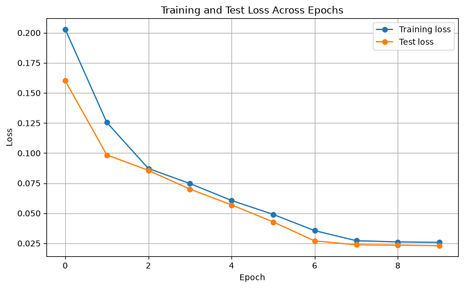
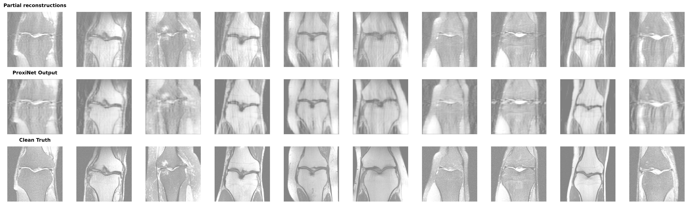
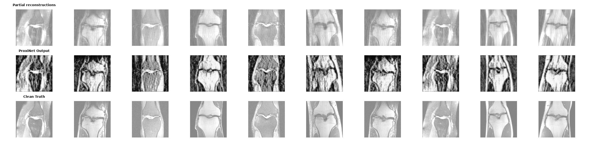

# Reconstructing-MRI-with-Machine-Learning-for-Signal-Processing-School-assignment

## The Problem and Architectural Rationale
In the healthcare industry, not only being able to reconstruct MRI-frames but also ensuring that the outcome meets a satisfactory degree of quality, are highly appealing prospects now tangible due to the arisen of smarter and more stable gradient-descent methods. 

Historically, methods like LISTA replace physical measurement matrices with trainable weights to learn the physical mapping directly from data, relying on a mathematically rigid shrinking rule lacking spatial awareness. This repository explores the inverse approach: **Neural Proximal Gradient Descent (Neural PGD)**. By hardcoding the Fourier transforms, we prevent the severe overfitting associated with learning massive global physics matrices. This frees the network's capacity to focus exclusively on learning complex non-linear human anatomy priors, while enforcing strict data consistency guarantees so the reconstructions remain physically plausible.

## The Prerequisites (Data & Models)
The current repository encompasses out-of-the-box (or well-trained) architectures of ISTA and LISTA, alongside experimental results supporting a comparison drawn between traditional and more advanced MRI-reconstruction methods. 

The development phase (including training, validation, and testing) was heavily dependent upon a subset of MRI-knee frames dislocated from the Facebook and NYU fastMRI datasets.

## The Results
By constructing a neural proximal gradient descent where a spatially-aware ConvNet typically acts as the proximal operator (or denoiser) in the backward/update step, the loss was reduced to a satisfactory extent. 

When evaluated on the test set, the models yielded the following Mean Squared Error (MSE) estimates:
* **ProxNet (Neural PGD, $K=5$):** MSE 0.027541
* **Standalone ConvNet:** MSE 0.269894
* **ConvNet + Data Consistency:** MSE 0.015410

These improvements are better illustrated by the figures below, tracking the loss chart and highlighting the network's ability to filter out coherent aliasing artifacts (ghosting ripples) without destroying the anatomical subject.

### Training and Test Loss Across Epochs

### Model Outputs & Artifact Analysis

*(Note: Earlier iterations utilizing Batch Normalization inadvertently clamped physical magnitude predictions, leading to gradient collapse. The resulting severe visual artifacts are documented below prior to the network's architectural correction).*

## Next Steps & Suggestions
Have an idea on how to further optimize the data consistency steps, increase the unfolded iterations ($K > 5$), or tweak the weighting factor ($\beta$) for better high-frequency detail? Feel free to open an issue or submit a pull request!